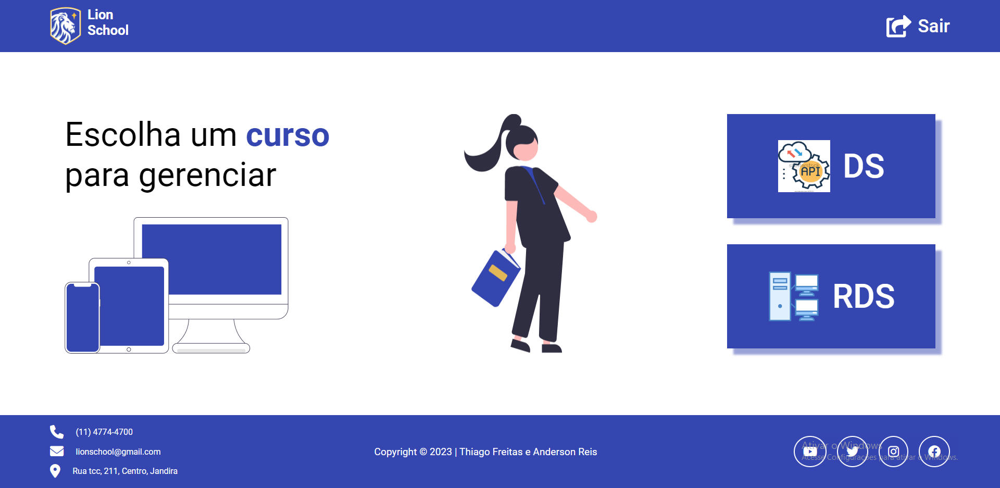

# Lion School

[Clique aqui](https://github.com/Thiago1223/lion-school)

[Figma](https://www.figma.com/file/ePwWlqquaySOdeHIvMAabV/Lion-School?node-id=0-1&t=l56vZ0m2tlMkIz8Y-0)

[Link para acessar o site](https://lion-school-fawn.vercel.app/)

# Sobre

Projeto de somativa com o intuito de criar um sistema de alunos para uma escola, integrando APIS feitas por nós, mais especificamente com o conhecimento adquirido nas disciplinas de PWFE (Programação web Front-end) e PWBE (Programação web Back-end) no curso do [SENAI Jandira](https://jandira.sp.senai.br/).

# Critérios de Avaliação 

- [x] Criou layout conforme designer feito no Figma?
- [x] Os botões dos cursos são dinâmicos?
- [x] Os cards são criados dinamicamente?
- [x] A página com informações dos cursos foi criada dinamicamente?
- [x] O filtro por status está funcional?
- [x] Os nomes das variáveis, funções e arquivos tem valor semântico?
- [x] A maioria das funções seguem as boas práticas como responsabilidade única?
- [x] Foi criado o layout responsivo no Figma?
- [x] Foi implementado a responsividade conforme planejado no Figma?
- [x] Foi criado o filtro por ano?

# Entregas

- [x] Cronograma de atividades
- [x] Documentação da API
- [x] Postman 

## Desafio extra

- [x] Além do GitHub Pages, pesquise e implemente outras opções gratuitas para hospedar o front-end.
- [x] Implemente o back-end na plataforma da Microsoft Azure e pesquisa outras opções gratuitas.

## Tecnologia utilizada 

- HTML5
- CSS3
- JavaScript
- Responsividade
- Markdown  
- JSON

## Professores
- [Fernando Leonid](https://github.com/fernandoleonid)
- [Marcel Teixeira](https://github.com/marcelnt)

## Autores
- [Thiago Freitas](https://github.com/Thiago1223)
- [Anderson Reis](https://github.com/Andersoreeis)
